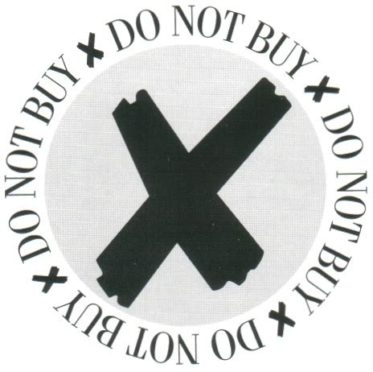

<!-- Headings -->
# **Boycott Inc.**


___

## *A Place to Share and Discuss Boycotts*

___

⚠️ ⚠️ Disclaimer: This web application is still in development and was made as an intensive exercise in less than a week. ⚠️ ⚠️ 
___

### Table of Contents

<ul>
<li><a href="#Rationale">Rationale</a>
<li><a href="#Description">Description</a>
<li><a href="#Getting Started">Getting Started</a> 
<li><a href="#Benefits">Benefits</a>
<li><a href="#Installation">Installation</a>
<li><a href="#Useful Links">Useful Links</a>
<li><a href="#Developer">Developer</a>
</ul>

#### Rationale

Rather than just share your latest gripes on social media, use a centralized hub to store and share information about unethical corporate and political behaviour. 

> I almost gave up on my social media accounts because there was so much negativity. Now I just look at pictures of cats, and leave my corporate complaints to Boycott Inc. I've learned so much from like minded boycotters. 

-Steve from Accounts

#### Description

Upload and edit information about your chosen boycotts. Leave comments and related links.

#### Benefits

* **Teach:** Share information about chosen boycotts with other people around the world.

* **Learn:** Learn from others as they add informative links and share their stories and experiences.

* **Campaign:** Sometimes a few voices can be drowned out, but together we are strong enough to make our targets notice our discontent.

* **Evolve:** Harness the power of collective efforts to bring petitions and claims against even the largest offenders. Don't let them get way with it.

#### Getting Started


#### Installation

<!-- Code Blocks -->
```python
npm install
```

#### Useful Links
[Buycott](https://www.buycott.com "Shop Smart")

#### Developer

| William Chadwick | teknofage@gmail.com |